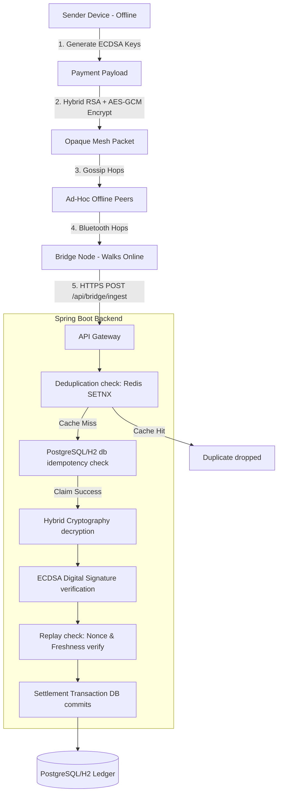

# 🌐 UPI Offline Mesh 2.0: Mesh-Routed Deferred Settlement Payment Network

UPI Offline Mesh 2.0 is a production-grade cryptographic showcase demonstrating **offline peer-to-peer payments** routed dynamically through an ad-hoc local mesh network (simulating Bluetooth BLE / Wi-Fi Direct) and settled automatically when any node reaches internet connectivity.

This project features a robust **Spring Boot backend** (with integrated Redis deduplication, hybrid RSA + AES-GCM encryption, and ECDSA digital signatures) coupled with a stunning **cinematic React + TypeScript + Tailwind + React Flow dashboard** that visualizes packet propagation through nodes in real-time.

---

## 📐 System Architecture



---

## 🔬 Detailed Scenario Walkthroughs & System Design

The visualizer dashboard demonstrates the network operations center (NOC) and security gateway reacting to 7 distinct scenarios. Below is the technical breakdown of what happens in the system during each simulation.

```mermaid
grid
    %% Scenario representation
```

### 📍 Scenario 1: Standard Successful Payment
*   **Trigger Event:** Alice creates a ₹500 payment request on her offline device (`Phone A`).
*   **Local Cryptographic Operations:**
    1.  **Instruction Compilation:** Creates a JSON payload with Sender VPA (`alice@pay`), Receiver VPA (`bob@pay`), Amount, Local Timestamp, and a unique UUID `Nonce`.
    2.  **ECDSA Signing:** Signs the payload hash using Alice's local private key (`secp256r1`) via `SHA256withECDSA`.
    3.  **Hybrid Key Exchange:** Generates an ephemeral **AES-256 session key**, encrypts the payload using **AES-256-GCM** (appending an authentication tag), and encrypts the AES session key with the central gateway's **RSA-2048 public key**.
    4.  **Packet Assembly:** Bundles the RSA-encrypted envelope, AES-encrypted ciphertext, and Alice's public key into a single `MeshPacket` object (TTL=5).
*   **Network Path:** The packet is broadcast over simulated BLE. It hops through nearby peers: `Phone A` ➔ `Phone C` ➔ `Phone F` ➔ `Bridge 1` (the internet-connected egress node).
*   **Gateway Validation & Settlement:**
    1.  **Ingestion:** `Bridge 1` makes an HTTP POST request to `/api/bridge/ingest`.
    2.  **Deduplication:** The gateway computes a SHA-256 hash of the ciphertext and checks Redis using `SETNX` (or falls back to database check). The lock is successfully claimed.
    3.  **Decryption:** The gateway uses its **RSA Private Key** to decrypt the AES session key, then decrypts the payload with **AES-GCM**, verifying packet integrity.
    4.  **Verification:** The gateway checks Alice's **ECDSA signature** using her public key and verifies that the `Nonce` has never been processed before.
    5.  **Settlement:** Executes a `@Transactional` debit of Alice's account and credit of Bob's account in the PostgreSQL/H2 ledger.

---

### 🌪️ Scenario 2: Duplicate Storm (Double-Spend Protection)
*   **Trigger Event:** Alice initiates a payment which is broadcast widely across the mesh.
*   **Network Path:** Due to multi-path mesh gossip routing, the same packet travels along two independent paths:
    *   Path Alpha: `Phone A` ➔ `Phone C` ➔ `Phone D` (Egress Bridge)
    *   Path Beta: `Phone A` ➔ `Phone I` ➔ `Bridge 1` (Egress Bridge)
*   **System Design & Concurrency Conflict:** Both `Phone D` and `Bridge 1` concurrently receive the identical packet and attempt to upload it to the Central Gateway at the exact same moment.
*   **Gateway Action:**
    1.  The gateway processes the `Bridge 1` request first: computes the ciphertext hash, claims the lock in **Redis** via `SETNX`, decrypts, verifies, and commits the settlement.
    2.  The gateway processes the `Phone D` request a millisecond later: computes the same ciphertext hash, attempts `SETNX` in Redis, but **the lock is denied** (key already exists).
    3.  The duplicate packet is immediately dropped at the cache layer with a `DUPLICATE_PACKET` outcome, preventing duplicate debits/credits in the ledger database.

---

### 🔄 Scenario 3: Replay Attack (Digital Nonce Validation)
*   **Trigger Event:** A malicious actor intercepts a legitimate, already-settled packet (containing a valid signature and nonce `[e5d735]`) and broadcasts it back into the mesh.
*   **Network Path:** The replayed packet traverses `Attacker Node` ➔ `Phone I` ➔ `Bridge 1` ➔ `Central Gateway`.
*   **Gateway Action:**
    1.  **Redis Check:** Since the original transaction occurred earlier, the temporary Redis lock key has expired, so the gateway allows the packet past the caching layer.
    2.  **Signature Check:** The signature is valid (since the payload was not modified).
    3.  **Nonce Verification:** The gateway queries the `Transaction` table (`txRepo.existsByNonce("[e5d735]")`).
    4.  **Incident Response:** The database finds that the nonce has already been processed in the ledger. The transaction is instantly aborted, the threat counter increments, and a critical `REPLAY_ATTACK` event is logged in the `security_events` table for forensic auditing.

---

### 💥 Scenario 4: Tampered Packet (Integrity & Decryption Tag Verification)
*   **Trigger Event:** Alice signs and broadcasts a ₹500 payment. A rogue intermediate node (`Phone C`) intercepts the packet and attempts to modify the amount to ₹50,000 inside the payload.
*   **Network Path:** `Phone A` ➔ `Phone C` (Alters Payload) ➔ `Phone D` ➔ `Bridge 1` ➔ `Central Gateway`.
*   **Gateway Action:**
    1.  The gateway receives the packet from `Bridge 1` and attempts to decrypt the payload.
    2.  It decrypts the AES-256 session key using its RSA private key, then starts decrypting the ciphertext block using **AES-256-GCM**.
    3.  Because `Phone C` modified the bytes, the **GCM Authenticated Decryption Tag check fails** (the MAC tag computed over the decrypted data does not match the tag appended at creation).
    4.  Decryption fails immediately, preventing the corrupted payload from being read. A `TAMPERED_PACKET` security alert is raised, and the ingestion is rejected.

---

### ✍️ Scenario 5: Invalid Signature (ECDSA Authentication & Anti-Spoofing)
*   **Trigger Event:** An attacker tries to forge a payment payload pretending to be Alice (VPA `alice@pay`) sending money to themselves, but does not possess Alice's ECDSA private key.
*   **Network Path:** `Attacker Node` ➔ `Phone I` ➔ `Bridge 1` ➔ `Central Gateway`.
*   **Gateway Action:**
    1.  **Decryption:** The attacker might encrypt the forged payload correctly using the gateway's public RSA key, so decryption succeeds.
    2.  **Signature Audit:** The gateway retrieves Alice's public key (registered in the `DeviceRegistry`) and runs signature verification against the payload and the attached signature blob.
    3.  **Verification Failure:** Because the signature was not created using Alice's private key, the `secp256r1` signature validation fails (`Signature.verify() == false`).
    4.  The gateway flags an `INVALID_SIGNATURE` threat event, aborts processing, and drops the payload.

---

### ⚠️ Scenario 6: Bridge Egress Failure (Offline Local Queuing)
*   **Trigger Event:** A bridge node (`Bridge 1`) loses internet/4G connectivity (simulating entering an elevator or basement).
*   **Network Path:** Alice (`Phone A`) initiates a payment. The packet hops through the mesh `Phone A` ➔ `Phone C` ➔ `Phone D` ➔ `Bridge 1`.
*   **Node Buffer Logic:**
    1.  `Bridge 1` receives the packet and attempts to forward it to the gateway API but detects it has no internet connectivity.
    2.  Instead of dropping the transaction, `Bridge 1` registers the packet in its **local persistent storage/queue** (buffer).
    3.  The packet is preserved locally, maintaining mesh persistence despite a lack of egress connection.

---

### ⚡ Scenario 7: Network Recovery (Buffer Flush & Deferred Settlement)
*   **Trigger Event:** `Bridge 1` (containing 1 buffered packet from Scenario 6) regains internet connection.
*   **Recovery & Flushing Logic:**
    1.  `Bridge 1` detects that connectivity is restored (simulating a transition to 4G/Wi-Fi).
    2.  The node automatically triggers a queue flush: it iterates through its local buffer, reads the stored `MeshPacket`, and uploads it to the `/api/bridge/ingest` endpoint.
    3.  The gateway receives, verifies, and settles the deferred transaction. The ledger commits the funds, proving that the mesh guarantees transaction delivery even with intermittent or partitioned connectivity.

---

## 🔒 Security Architecture & Threat Model

| Threat Vector | Mitigation Strategy | Outcome |
| :--- | :--- | :--- |
| **Intermediate Snooping** | Hybrid Encryption: RSA-OAEP + AES-256-GCM | Intermediaries/routers see only base64-encoded encrypted blobs. |
| **Packet Tampering** | AES-GCM Authenticated Decryption Tag check | Flipped bits cause tag verification failure, rejecting the packet as `TAMPERED_PACKET`. |
| **Payload Spoofing** | ECDSA Digital Signatures (SHA256withECDSA) | Senders sign instructions; invalid/forged signatures are instantly rejected. |
| **Replay Attacks** | Unique Nonce checks + 24-hour freshness window | Reused nonces or expired signatures are rejected as `REPLAY_ATTACK`. |
| **Double-Spend Storm** | Redis `SETNX` distributed lock with database fallback | Concurrent uploads lock on ciphertext hash, settling exactly once. |

---

## 🛠️ Tech Stack

*   **Backend:** Spring Boot (Java 21), Spring Data JPA, Spring Security (CORS/CSRF configured), Redis, PostgreSQL / H2 Database, Maven.
*   **Frontend:** React 18, Vite, TypeScript, TailwindCSS, React Flow, Lucide React, Framer Motion.
*   **Ops & Metrics:** Docker & Docker Compose, Prometheus, Grafana.

---

## 💻 Running the Application

### Option A: Running via Docker Compose (Recommended)
This launches the backend, frontend, postgres, redis, prometheus, and grafana with a single command:
```bash
docker compose up --build
```
Once started, the services are mapped as follows:
*   🌐 **React Visualizer Dashboard:** [http://localhost](http://localhost) (Port 80)
*   ⚙️ **Spring Boot REST APIs:** [http://localhost:8080](http://localhost:8080)
*   📈 **Prometheus Scraper:** [http://localhost:9090](http://localhost:9090)
*   📊 **Grafana Dashboards:** [http://localhost:3000](http://localhost:3000) (Login: `admin` / `admin`)

### Option B: Local Standalone Development (No Docker)
1. **Build and package the frontend assets into Spring Boot's static folder:**
   ```bash
   cd frontend
   npm install
   npm run build
   cd ..
   ```
2. **Compile and run the Spring Boot Application:**
   ```bash
   # Spring Boot will run with H2 (in-memory) and local cache fallbacks if Postgres/Redis are offline
   ./mvnw spring-boot:run
   ```
3. Open [http://localhost:8080](http://localhost:8080) in your browser to access the visualizer dashboard.

---

## ☁️ Deploying to Cloud (Render / Railway)

Because the React frontend is compiled and bundled into the Spring Boot backend's static directory (`src/main/resources/static`), the entire project can be deployed to the cloud as a **single standalone Java service**.

### Step 1: Connect your GitHub Repo
Connect this repository to **Railway.app**, **Render.com**, or **Zeabur.com**.

### Step 2: Configure Environment Variables
If using production databases, set these environment variables on your cloud provider:
*   `SPRING_PROFILES_ACTIVE=prod`
*   `SPRING_DATASOURCE_URL=jdbc:postgresql://your-db-host:port/dbname`
*   `SPRING_DATASOURCE_USERNAME=your_db_username`
*   `SPRING_DATASOURCE_PASSWORD=your_db_password`
*   `SPRING_DATA_REDIS_HOST=your_redis_host`
*   `SPRING_DATA_REDIS_PORT=your_redis_port`
*   `SPRING_DATA_REDIS_PASSWORD=your_redis_password`

If these are not provided, the application will automatically fall back to an **H2 in-memory database** and an **in-memory concurrent map cache**, allowing you to deploy a fully functional demo in seconds without provisioning database services!

### Step 3: Build Command
Set the build command on your cloud platform:
```bash
# This compiles the frontend, moves assets, and builds the deployable Spring Boot JAR
cd frontend && npm install && npm run build && cd .. && ./mvnw clean package -DskipTests
```

### Step 4: Start Command
Set the start command to launch the generated JAR:
```bash
java -jar target/upi-offline-mesh-0.0.1-SNAPSHOT.jar
```

Developed with ❤️ for secure, decentralized financial inclusion.
