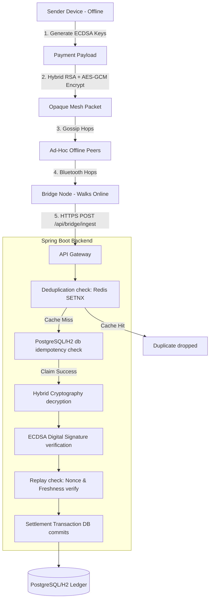

# 🌐 UPI Offline Mesh 2.0: Mesh-Routed Deferred Settlement Payment Network

UPI Offline Mesh 2.0 is a production-grade cryptographic showcase demonstrating **offline peer-to-peer payments** routed dynamically through an ad-hoc local mesh network (simulating Bluetooth BLE / Wi-Fi Direct) and settled automatically when any node reaches internet connectivity.

This project features a robust **Spring Boot backend** (with integrated Redis deduplication, hybrid RSA + AES-GCM encryption, and ECDSA digital signatures) coupled with a stunning **cinematic React + TypeScript + Tailwind + React Flow dashboard** that visualizes packet propagation through nodes in real-time.

---

## 🚀 Key Features

* **⚡ Offline Transaction Engine:** Generates and cryptographically signs transaction instructions completely offline on sender devices.
* **🛡️ Hybrid Cryptography:** Multi-layered security using **RSA-OAEP** for key wrapping and **AES-GCM (256-bit)** for payload encryption (ensuring integrity and confidentiality).
* **✍️ Digital Signatures:** Transactions are digitally signed using **ECDSA (secp256r1)** to prevent sender spoofing and tampering.
* **🔗 Dynamic Mesh Routing:** Simulates packet-based multi-hop gossip protocols over ad-hoc networks, hopping through intermediate peer nodes to find an online bridge.
* **🛑 Replay & Double-Spend Protection:** Prevents duplicate ingestion using a dual-layered distributed lock: **Redis SETNX** at the caching layer and **PostgreSQL/H2 unique constraints** at the database layer.
* **🌌 Cinematic NOC Dashboard:** A dark-mode visualization console showcasing glowing network nodes, real-time packet propagation paths, node disconnection simulations, and a live security ledger.
* **📊 Observability Stack:** Automated scraping of API endpoints with **Prometheus** and pre-configured **Grafana** dashboards monitoring transaction throughput, mesh health, and security alerts.

---

## 📐 System Architecture



---

## 🔒 Security Architecture & Threat Model

| Threat Vector | Mitigation Strategy | Outcome |
| :--- | :--- | :--- |
| **Intermediate Snooping** | Hybrid Encryption: RSA-OAEP + AES-256-GCM | Intermediaries/routers see only base64-encoded encrypted blobs. |
| **Packet Tampering** | AES-GCM Authenticated Decryption Tag check | Flipped bits cause tag verification failure, rejecting the packet as `TAMPERED_PACKET`. |
| **Payload Spoofing** | ECDSA Digital Signatures (SHA256withECDSA) | Senders sign instructions; invalid/forged signatures are instantly rejected. |
| **Replay Attacks** | Unique Nonce checks + 24-hour freshness window | Reused nonces or expired signatures are rejected as `REPLAY_ATTACK`. |
| **Double-Spend Storm** | Redis `SETNX` distributed lock with database fallback | Concurrent uploads lock on ciphertext hash, settling exactly once. |

---

## 🛠️ Tech Stack

* **Backend:** Spring Boot (Java 21), Spring Data JPA, Spring Security (CORS/CSRF configured), Redis, PostgreSQL / H2 Database, Maven.
* **Frontend:** React 18, Vite, TypeScript, TailwindCSS, React Flow, Lucide React, Framer Motion.
* **Ops & Metrics:** Docker & Docker Compose, Prometheus, Grafana.

---

## 💻 Running the Application

### Option A: Running via Docker Compose (Recommended)
This launches the backend, frontend, postgres, redis, prometheus, and grafana with a single command:
```bash
docker compose up --build
```
Once started, the services are mapped as follows:
* 🌐 **React Visualizer Dashboard:** [http://localhost](http://localhost) (Port 80)
* ⚙️ **Spring Boot REST APIs:** [http://localhost:8080](http://localhost:8080)
* 📈 **Prometheus Scraper:** [http://localhost:9090](http://localhost:9090)
* 📊 **Grafana Dashboards:** [http://localhost:3000](http://localhost:3000) (Login: `admin` / `admin`)

### Option B: Local Standalone Development (No Docker)
1. **Build and package the frontend assets into Spring Boot's static folder:**
   ```bash
   cd frontend
   npm install
   npm run build
   cd ..
   ```
2. **Compile and run the Spring Boot Application:**
   ```bash
   # Spring Boot will run with H2 (in-memory) and local cache fallbacks if Postgres/Redis are offline
   ./mvnw spring-boot:run
   ```
3. Open [http://localhost:8080](http://localhost:8080) in your browser to access the visualizer dashboard.

---

## ☁️ Deploying to Cloud (Render / Railway)

Because the React frontend is compiled and bundled into the Spring Boot backend's static directory (`src/main/resources/static`), the entire project can be deployed to the cloud as a **single standalone Java service**.

### Step 1: Connect your GitHub Repo
Connect this repository to **Railway.app** or **Render.com**.

### Step 2: Configure Environment Variables
If using production databases, set these environment variables on your cloud provider:
* `SPRING_PROFILES_ACTIVE=prod`
* `SPRING_DATASOURCE_URL=jdbc:postgresql://your-db-host:port/dbname`
* `SPRING_DATASOURCE_USERNAME=your_db_username`
* `SPRING_DATASOURCE_PASSWORD=your_db_password`
* `SPRING_DATA_REDIS_HOST=your_redis_host`
* `SPRING_DATA_REDIS_PORT=your_redis_port`
* `SPRING_DATA_REDIS_PASSWORD=your_redis_password`

If these are not provided, the application will automatically fall back to an **H2 in-memory database** and an **in-memory concurrent map cache**, allowing you to deploy a fully functional demo in seconds without provisioning database services!

### Step 3: Build Command
Set the build command on your cloud platform:
```bash
# This compiles the frontend, moves assets, and builds the deployable Spring Boot JAR
cd frontend && npm install && npm run build && cd .. && ./mvnw clean package -DskipTests
```

### Step 4: Start Command
Set the start command to launch the generated JAR:
```bash
java -jar target/upimesh-0.0.1-SNAPSHOT.jar
```

---

## 📈 Demo Workflows to Try

1. **Successful Offline Payment:**
   * Enter sender phone (e.g. `9876543210`), receiver phone (e.g. `8765432109`), and amount (e.g. `250`).
   * Press **🚀 Start Payment Simulation**.
   * Watch the packet travel through the mesh network node-by-hop until it reaches the green **Online Bridge Node** and is ingested and settled instantly.

2. **Network Partition / Disconnect Simulation:**
   * Double-click any mesh node on the visualizer to disconnect it from the network (it will turn red).
   * Try sending a payment. Watch the packet route around the disconnected node to find a path, or queue up if no path exists.
   * Reconnect the node and watch the queued transactions propagate and settle.

3. **Replay Attack / Duplicate Storm Simulation:**
   * In the Control Panel, turn on **Simulate Replay Attack**.
   * Run a simulation. The visualizer will attempt to ingest the exact same mesh packet multiple times.
   * Observe the **Security Audit Center** catching the duplication attempt and dropping it, while preserving database integrity.

---

Developed with ❤️ for secure, decentralized financial inclusion.
